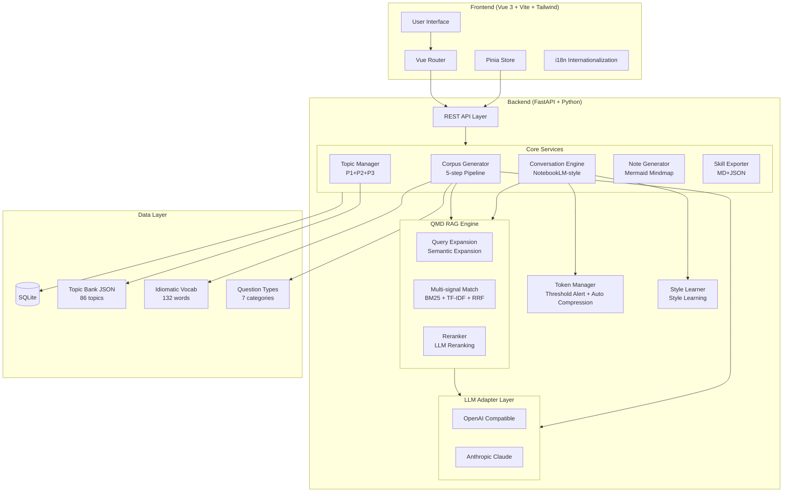

# PersonaLingo v2

> AI-Powered Personalized IELTS Speaking Corpus Generator with RAG & Memory System

## ✨ Features

- **Smart Corpus Generation** — 5-step LLM-driven pipeline (Persona → Anchors → Bridges → Vocabulary → Patterns)
- **Dual LLM Support** — OpenAI & Anthropic with seamless switching
- **QMD RAG Engine** — Query-Match-Decide 3-layer retrieval (Query Expansion + BM25/TF-IDF dual-channel + LLM Reranking)
- **Dynamic Topic Bank** — P1/P2 IELTS topics with season/category filtering
- **NotebookLM-style Chat** — Conversational corpus maintenance with style learning
- **Material Upload** — Parse .txt/.md/.docx/.pdf to enrich your corpus
- **Smart Notes** — Auto-generated learning notes & Mermaid mind maps
- **Band Score Strategies** — Differentiated output for 6.0/6.5/7.0/7.5+ targets
- **Skill Export** — Export as Markdown or JSON for AI agent integration

## 🏗️ Architecture



## 🔍 QMD RAG Engine

PersonaLingo features a custom-built **QMD (Query-Match-Decide)** 3-layer retrieval-augmented architecture, achieving high-quality corpus retrieval with zero external model dependencies:

### Three-Layer Architecture

| Layer | Function | Implementation |
|-------|----------|----------------|
| **Q - Query Expansion** | Query expansion | LLM semantic expansion + synonym rule fallback |
| **M - Multi-signal Match** | Multi-signal matching | BM25 (term frequency) + TF-IDF (semantic) + RRF fusion ranking |
| **D - Decide/Rerank** | Intelligent reranking | LLM relevance scoring + rule fallback |

### Workflow

```
User Query → [Q Layer] Expand into multiple search terms
           → [M Layer] BM25 + TF-IDF dual-channel retrieval → RRF fusion
           → [D Layer] LLM reranking → Top-K results
```

### Design Philosophy

- **Lightweight**: No dependency on embedding models or vector databases — pure algorithms + LLM API
- **Graceful Degradation**: Each layer has fallback mechanisms; degrades to pure rule-based retrieval without LLM
- **Fast Mode**: Provides `search_fast()` for conversation scenarios, skipping Q/D layers for rapid retrieval

## 🛠️ Tech Stack

| Layer | Technology |
|-------|-----------|
| Frontend | Vue 3, Vite, Tailwind CSS, Pinia, Mermaid.js |
| Backend | FastAPI, Python 3.11+, aiosqlite |
| LLM | OpenAI API, Anthropic Claude API |
| Database | SQLite (async) |
| Search | QMD RAG (BM25 + TF-IDF + RRF fusion, pure Python) |
| File Parsing | python-docx, PyPDF2 |
| Deployment | Docker, nginx |

## 📸 Screenshots

<p align="center">
  
  
  
</p>
<p align="center">
  <sub>User Profiling Questionnaire &nbsp;|&nbsp; AI Conversation Engine &nbsp;|&nbsp; Topic Browser</sub>
</p>

## 🤖 Skills Integration

PersonaLingo ships two independent skill delivery modes. Pick the one that matches your agent setup.

### Mode 1 · Install-only (recommended, zero backend)

One-line install to any skill-compatible agent (Claude / Qoder / Cursor / Cline / ...). No project code, no server. The agent itself drives **questionnaire → guided conversation → 7-step distillation → personal profile → static corpus site** using only the shipped prompt assets.

```bash
# Subpath-targeted install (vercel-labs/skills CLI) — only the skill package is copied
npx skills add https://github.com/orzcls/PersonaLingo/tree/main/skills/personalingo

# Equivalent shorthand
npx skills add orzcls/PersonaLingo --skill personalingo
```

What actually lands in `.agents/skills/personalingo/` (CLI copies only the `skills/personalingo/` subdirectory — backend/frontend/docs are never pulled):

```
SKILL.md
skill.json
skill-assets/
  ├── questionnaire.json
  ├── conversation-guide.md
  ├── distill-protocol.md
  ├── corpus-schema.json        # mirrors backend models/corpus.py field shapes
  ├── band-strategies.json      # 1:1 copy of backend/app/data/band_strategies.json
  ├── fallback-topics.json      # executable Stage 5 fallback
  ├── fallback-vocabulary.json  # executable Stage 6 fallback (4 bands × 10 items)
  ├── fallback-patterns.json    # executable Stage 7 fallback (8 MBTI-agnostic patterns)
  ├── profile-template.md
  └── site-template.html
```

> **Backend architecture equivalence**: install-only `corpus.json` is consumable by the same downstream logic as runnable-export output. `learner_profile` / `capability_framework` / `anchors` / `bridges` / `vocabulary` / `patterns` / `practices` / `band_strategy` all mirror backend [`models/corpus.py`](backend/app/models/corpus.py) & [`services/{learner_researcher,capability_framework,corpus_generator}.py`](backend/app/services) exact field shapes. Stage 3–7 prompts **must** inject `band_strategy` from `band-strategies.json`.

Per-learner outputs are written to the agent's working directory:

```
corpus/<corpus_id>/
  ├── answers.json
  ├── dialogue.md
  ├── corpus.json      # validated against skill-assets/corpus-schema.json
  ├── profile.md
  └── site/index.html  # open directly in browser
```

Full runtime spec: [SKILL.md](SKILL.md).

### Mode 2 · Runnable Export (requires running this project)

Use the full backend + frontend to generate a persistent, QMD-RAG-powered skill pack backed by SQLite, then export a zip that a downstream agent consumes.

```bash
# Start backend (see Quick Start below), then:
curl -X POST http://localhost:9849/api/distill/diagnose
curl -X POST "http://localhost:9849/api/distill/run?questionnaire_id={id}&include_research=true"
curl  http://localhost:9849/api/distill/skill/{corpus_id}/runnable/download -o skill.zip
```

Exported pack contents: `Skill.md` · `corpus.json` · `runtime_protocol.md` · `prompts/`. See [skills/RUNNABLE_MODE.md](skills/RUNNABLE_MODE.md).

### Mode comparison

| Capability | Install-only | Runnable Export |
|---|---|---|
| Backend dependency | None | Python 3.11+ backend at `:9849` |
| Install command | `npx skills add orzcls/PersonaLingo --skill personalingo` | `git clone` + `docker-compose up` |
| Questionnaire / dialogue / distill | Agent-internal loop | Backend API + Vue UI |
| Dynamic IELTS topic bank sync | No | Yes (seasonal auto-sync) |
| QMD RAG retrieval | No | BM25 + TF-IDF + RRF + LLM rerank |
| Style learning persistence | Session-only | SQLite persisted |
| Static corpus site output | Yes (`site/index.html`) | No (use frontend pages) |
| Best for | Drop-in agent install | Tutoring platforms / long-running learners |

## 🚀 Quick Start

### Prerequisites

- Python 3.11+
- Node.js 18+
- OpenAI or Anthropic API key

### Backend

```bash
cd backend
pip install -r requirements.txt
cp .env.example .env
# Edit .env with your API keys
python run.py
# Server runs at http://localhost:9849
```

### Frontend

```bash
cd frontend
npm install
npm run dev
# Opens at http://localhost:5273
```

### Docker

```bash
docker-compose up -d
# Frontend: http://localhost:5273
# Backend API: http://localhost:9849
```

### Windows (No Docker)

Double-click `start.bat` or run in PowerShell:

```powershell
.\start.ps1
```

This will install dependencies and start both services:
- Backend: http://localhost:9849
- Frontend: http://localhost:5273

## 📁 Project Structure

```
PersonaLingo/
├── backend/
│   ├── app/
│   │   ├── data/              # SQLite DB & JSON data files
│   │   ├── db/                # Database CRUD & schemas
│   │   ├── models/            # Pydantic models
│   │   ├── routers/           # API route handlers
│   │   ├── services/          # Core business logic
│   │   │   ├── llm_adapter.py        # Multi-provider LLM interface
│   │   │   ├── corpus_generator.py   # 5-step generation pipeline
│   │   │   ├── corpus_rag.py         # QMD RAG engine (BM25+TF-IDF+RRF)
│   │   │   ├── qmd_engine.py         # QMD 3-layer engine (Q/M/D)
│   │   │   ├── conversation_engine.py # Chat with style learning
│   │   │   ├── note_generator.py     # Notes & mindmap generation
│   │   │   ├── material_parser.py    # File upload processing
│   │   │   ├── topic_manager.py      # Topic bank management
│   │   │   ├── skill_exporter.py     # Export to MD/JSON
│   │   │   └── token_manager.py      # Token counting & limits
│   │   ├── config.py          # App configuration
│   │   ├── database.py        # Async DB setup
│   │   └── main.py            # FastAPI app entry
│   ├── .env.example
│   ├── Dockerfile
│   ├── requirements.txt
│   └── run.py
├── frontend/
│   ├── src/
│   │   ├── api/               # API client
│   │   ├── components/        # Vue components
│   │   │   ├── chat/          # Chat interface
│   │   │   ├── corpus/        # Corpus management
│   │   │   ├── notes/         # Notes viewer
│   │   │   ├── questionnaire/ # User profiling
│   │   │   └── topics/        # Topic browser
│   │   ├── router/            # Vue Router
│   │   ├── stores/            # Pinia state management
│   │   └── views/             # Page views
│   ├── Dockerfile
│   ├── nginx.conf
│   └── package.json
├── skills/                    # Exported AI agent skills
├── docker-compose.yml
└── README.md
```

## 🎯 Core Workflows

### 1. Corpus Generation (Three-Stage Distill · v3.0)

> **v3.0 Upgrade**: Inspired by `huashu-nuwa`'s three-stage pattern (Deep Research → Thinking Framework → Runnable Skill), the distill pipeline is front-loaded with two extra stages. The original 5 steps expand into **7 steps**, and a new "Runnable Skill Pack" is produced as the third-stage artifact. Stage 1/2 failures gracefully fall back to the legacy 5-step path (backward compatible).

```
Questionnaire + Materials + Conversations + Topics
  → [Stage 1] Deep Research (learner_profile)
  → [Stage 2] Capability Framework distillation
  → [Stage 3] User Persona → Anchor Stories → Topic Bridges
             → Vocabulary Upgrade → Pattern Templates
  → [Delivery] Corpus + Runnable Skill Pack (4 artifacts)
```

**Three-Stage API**: `POST /api/distill/diagnose` · `POST /api/distill/run` · `GET /api/distill/skill/{id}/runnable[/download]`

### 2. Conversation Maintenance

```
User Message → RAG Context Retrieval → LLM Response
→ Corpus Extraction → Style Learning → Corpus Update
```

### 3. Skill Export

```
Corpus Data → Workflow Documentation → MD/JSON Export → AI Agent Integration
```

## 📄 License

MIT

## 🙏 Acknowledgments

- Distillation pipeline architecture inspired by [nuwa-skill](https://github.com/alchaincyf/nuwa-skill) — the "Deep Research → Mental Framework → Runnable Skill" paradigm for distilling human expertise into AI-native skill packages.
