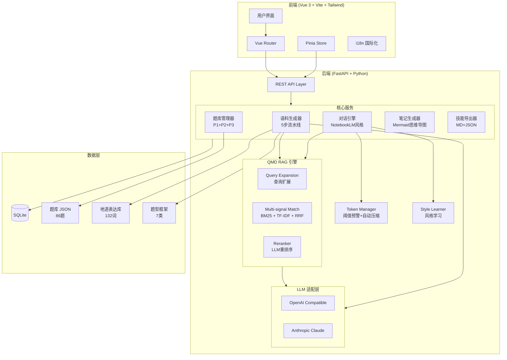
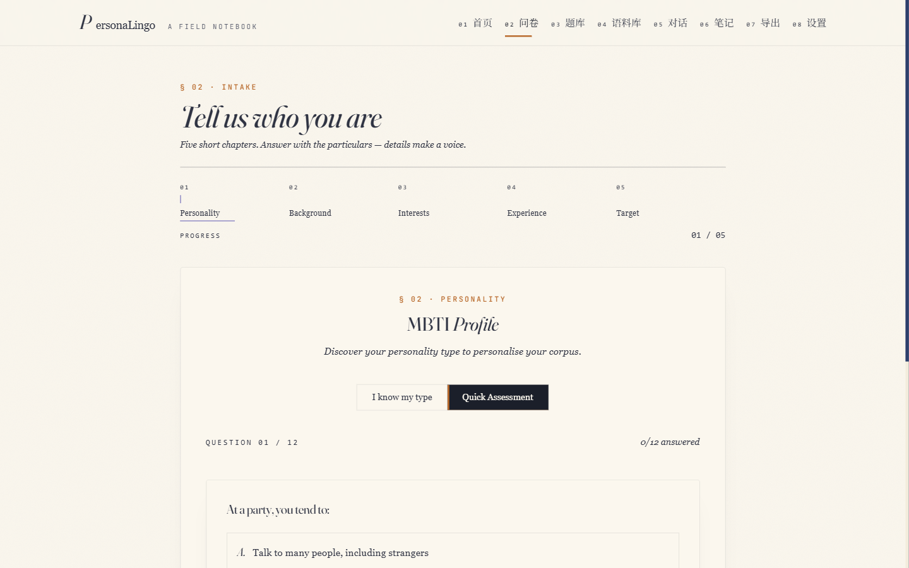
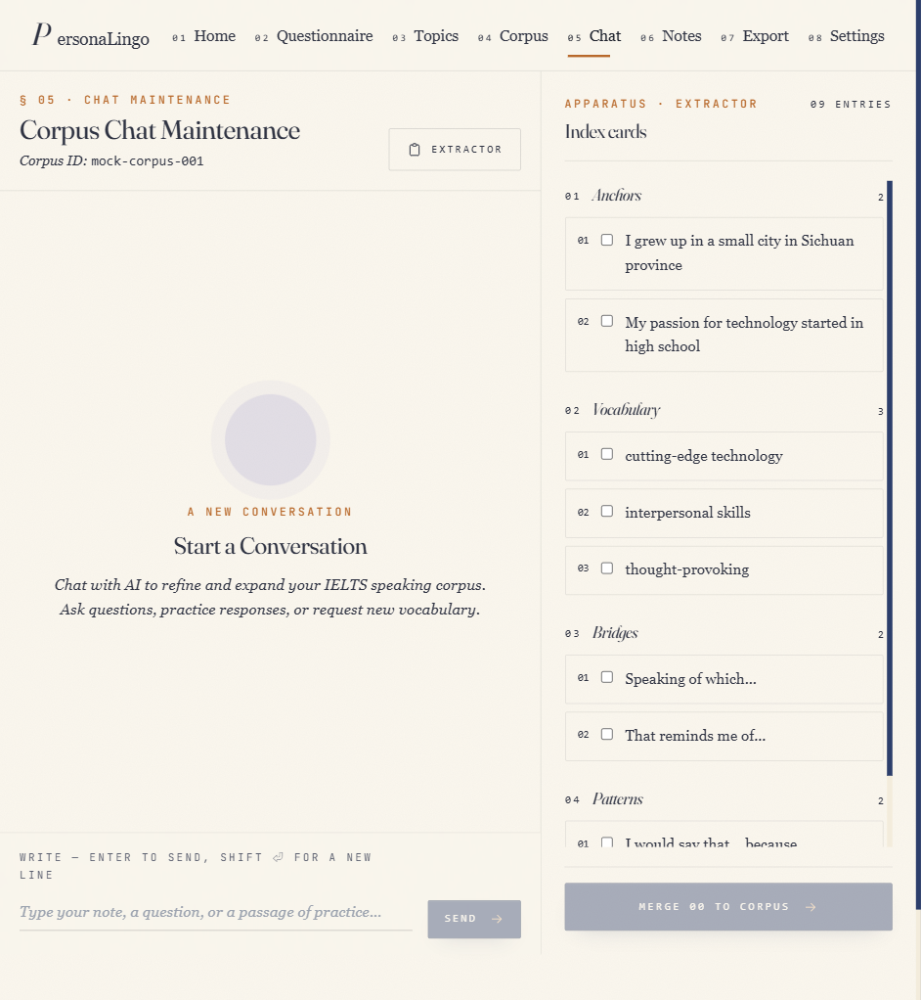
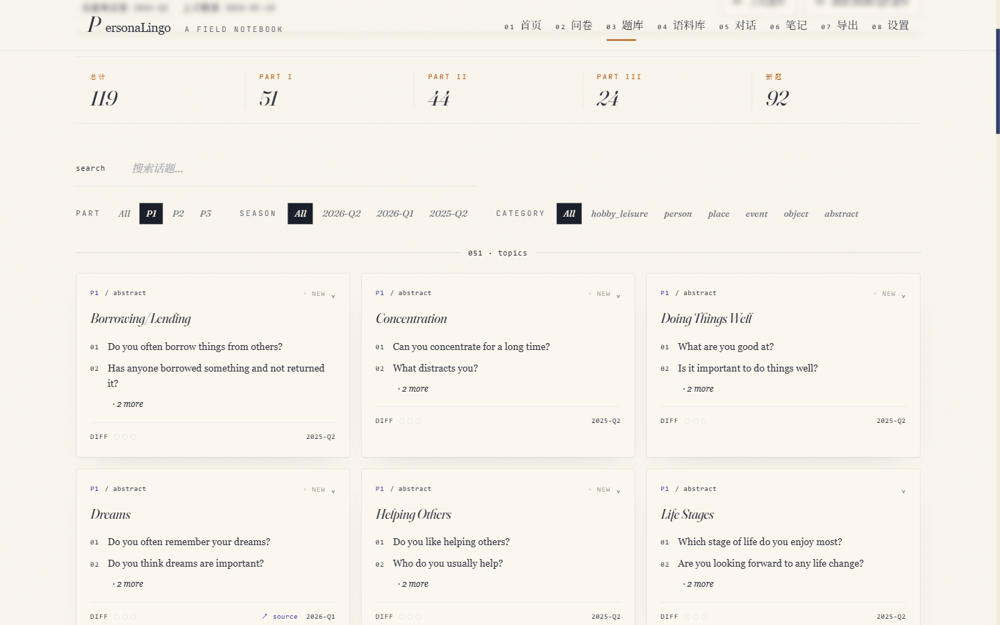

# PersonaLingo v2

> AI 驱动的个性化雅思口语语料库生成器，集成 RAG 检索与记忆系统

## ✨ 核心功能

- **智能语料生成** — 5 步 LLM 驱动流水线（人设 → 锚点故事 → 话题桥接 → 词汇升级 → 模式模板）
- **双 LLM 支持** — OpenAI 与 Anthropic 无缝切换
- **QMD RAG 引擎** — Query-Match-Decide 三层检索架构（查询扩展 + BM25/TF-IDF 双通道 + LLM 重排序）
- **动态题库** — P1/P2 雅思口语话题，支持季度/分类筛选
- **NotebookLM 风格对话** — 对话式语料维护与风格学习
- **素材上传** — 解析 .txt/.md/.docx/.pdf 文件丰富语料库
- **智能笔记** — 自动生成学习笔记与 Mermaid 思维导图
- **分数段策略** — 针对 6.0/6.5/7.0/7.5+ 目标差异化输出
- **技能导出** — 导出为 Markdown 或 JSON，用于 AI Agent 集成

## 🏗️ 系统架构



## 🔍 QMD RAG 引擎

PersonaLingo 采用自研的 **QMD（Query-Match-Decide）** 三层检索增强架构，实现零外部模型依赖的高质量语料检索：

### 三层架构

| 层级 | 功能 | 实现方式 |
|------|------|----------|
| **Q - Query Expansion** | 查询扩展 | LLM 语义扩展 + 同义词规则 fallback |
| **M - Multi-signal Match** | 多信号匹配 | BM25（词频） + TF-IDF（语义） + RRF 融合排序 |
| **D - Decide/Rerank** | 智能重排序 | LLM 相关性评分 + 规则 fallback |

### 工作流程

```
用户查询 → [Q层] 扩展为多个检索词
         → [M层] BM25 + TF-IDF 双通道检索 → RRF 融合
         → [D层] LLM 重排序 → Top-K 结果
```

### 设计理念

- **轻量化**：不依赖 embedding 模型或向量数据库，纯算法 + LLM API
- **渐进降级**：每层都有 fallback 机制，无 LLM 时退化为纯规则检索
- **快速模式**：对话场景提供 `search_fast()` 跳过 Q/D 层的快速检索

## 🛠️ 技术栈

| 层级 | 技术 |
|------|------|
| 前端 | Vue 3, Vite, Tailwind CSS, Pinia, Mermaid.js |
| 后端 | FastAPI, Python 3.11+, aiosqlite |
| LLM | OpenAI API, Anthropic Claude API |
| 数据库 | SQLite (异步) |
| 检索 | QMD RAG (BM25 + TF-IDF + RRF 融合, 纯 Python 实现) |
| 文件解析 | python-docx, PyPDF2 |
| 部署 | Docker, nginx |

## 📸 功能展示

<p align="center">
  
  
  
</p>
<p align="center">
  <sub>用户画像问卷 &nbsp;|&nbsp; AI 对话引擎 &nbsp;|&nbsp; 话题浏览筛选</sub>
</p>

## 🤖 技能集成

PersonaLingo 提供两条**彼此独立**的 Skill 交付路线，按 Agent 部署形态自由选择。

### 模式 1 · Install-only（推荐，零后端）

一行命令安装到任何兼容 skill 协议的 Agent（Claude / Qoder / Cursor / Cline ……）。不带项目代码、不需要服务，Agent 用自带 LLM 即可完成「**问卷 → 引导对话 → 7 步蒸馏 → 个人画像 → 静态语料网站**」全链路。

```bash
npx skills add orzcls/PersonaLingo
```

实际落到 `.agents/skills/personalingo/` 的内容（CLI 自动发现仓库里的 `skills/personalingo/` 子目录并只复制该子目录，backend/frontend/docs 不会被拉）：

```
SKILL.md
skill.json
skill-assets/
  ├── questionnaire.json
  ├── conversation-guide.md
  ├── distill-protocol.md
  ├── corpus-schema.json        # 镜像后端 models/corpus.py 字段结构
  ├── band-strategies.json      # 与 backend/app/data/band_strategies.json 1:1 同步
  ├── fallback-topics.json      # Stage 5 可执行降级话题库
  ├── fallback-vocabulary.json  # Stage 6 可执行降级词表（4 档 × 10 条）
  ├── fallback-patterns.json    # Stage 7 可执行降级句型（MBTI-无关 8 条）
  ├── profile-template.md
  └── site-template.html
```

> **架构等价保证**：install-only 产出的 `corpus.json` 能被与 runnable-export 完全相同的下游逻辑消费。`learner_profile` / `capability_framework` / `anchors` / `bridges` / `vocabulary` / `patterns` / `practices` / `band_strategy` 八块字段 shape 与后端 [`models/corpus.py`](backend/app/models/corpus.py) 、[`services/{learner_researcher,capability_framework,corpus_generator}.py`](backend/app/services) 逐字对齐。Stage 3–7 的 system prompt **必须**从 `band-strategies.json` 注入 `band_strategy` 块。

每个学习者的产物写入 Agent 当前工作目录：

```
corpus/<corpus_id>/
  ├── answers.json
  ├── dialogue.md
  ├── corpus.json      # 通过 skill-assets/corpus-schema.json 校验
  ├── profile.md
  └── site/index.html  # 浏览器直接打开
```

完整运行时协议见 [SKILL.md](SKILL.md)。

### 模式 2 · Runnable Export（需部署本项目）

跑起本仓库的前后端，通过 QMD RAG 引擎 + SQLite 产出长期可复用的技能包 zip，下游 Agent 加载后即可开讲。

```bash
# 启动后端（见下文 Quick Start），然后：
curl -X POST http://localhost:9849/api/distill/diagnose
curl -X POST "http://localhost:9849/api/distill/run?questionnaire_id={id}&include_research=true"
curl  http://localhost:9849/api/distill/skill/{corpus_id}/runnable/download -o skill.zip
```

导出包内容：`Skill.md` · `corpus.json` · `runtime_protocol.md` · `prompts/`。详情见 [skills/RUNNABLE_MODE.md](skills/RUNNABLE_MODE.md)。

### 模式对比

| 能力 | Install-only | Runnable Export |
|---|---|---|
| 后端依赖 | 无 | Python 3.11+ 后端监听 `:9849` |
| 安装命令 | `npx skills add orzcls/PersonaLingo` | `git clone` + `docker-compose up` |
| 问卷 / 对话 / 蒸馏 | Agent 内闭环 | 后端 API + Vue 前端 |
| 动态 IELTS 题库同步 | 不支持 | 支持（季度自动同步） |
| QMD RAG 检索 | 不支持 | BM25 + TF-IDF + RRF + LLM 重排 |
| 风格学习持久化 | 仅单次会话 | SQLite 持久化 |
| 静态语料网站产物 | 支持（`site/index.html`） | 无（使用前端页面） |
| 适用场景 | Agent 即插即用 | 辅导平台 / 长期学员 |

## 🚀 快速开始

### 环境要求

- Python 3.11+
- Node.js 18+
- OpenAI 或 Anthropic API 密钥

### 后端启动

```bash
cd backend
pip install -r requirements.txt
cp .env.example .env
# 编辑 .env 填入你的 API 密钥
python run.py
# 服务运行在 http://localhost:9849
```

### 前端启动

```bash
cd frontend
npm install
npm run dev
# 访问 http://localhost:5273
```

### Docker 部署

```bash
docker-compose up -d
# 前端: http://localhost:5273
# 后端 API: http://localhost:9849
```

### Windows 快速启动（无需 Docker）

双击 `start.bat` 或在 PowerShell 中运行：

```powershell
.\start.ps1
```

自动安装依赖并启动服务：
- 后端: http://localhost:9849
- 前端: http://localhost:5273

## 📁 项目结构

```
PersonaLingo/
├── backend/
│   ├── app/
│   │   ├── data/              # SQLite 数据库 & JSON 数据文件
│   │   ├── db/                # 数据库 CRUD & 模式定义
│   │   ├── models/            # Pydantic 模型
│   │   ├── routers/           # API 路由处理器
│   │   ├── services/          # 核心业务逻辑
│   │   │   ├── llm_adapter.py        # 多供应商 LLM 接口
│   │   │   ├── corpus_generator.py   # 5 步生成流水线
│   │   │   ├── corpus_rag.py         # QMD RAG 引擎 (BM25+TF-IDF+RRF)
│   │   │   ├── qmd_engine.py         # QMD 三层引擎 (Q/M/D)
│   │   │   ├── conversation_engine.py # 对话 + 风格学习
│   │   │   ├── note_generator.py     # 笔记 & 思维导图生成
│   │   │   ├── material_parser.py    # 文件上传处理
│   │   │   ├── topic_manager.py      # 话题库管理
│   │   │   ├── skill_exporter.py     # 导出为 MD/JSON
│   │   │   └── token_manager.py      # Token 计数 & 限制
│   │   ├── config.py          # 应用配置
│   │   ├── database.py        # 异步数据库初始化
│   │   └── main.py            # FastAPI 应用入口
│   ├── .env.example
│   ├── Dockerfile
│   ├── requirements.txt
│   └── run.py
├── frontend/
│   ├── src/
│   │   ├── api/               # API 客户端
│   │   ├── components/        # Vue 组件
│   │   │   ├── chat/          # 对话界面
│   │   │   ├── corpus/        # 语料管理
│   │   │   ├── notes/         # 笔记查看
│   │   │   ├── questionnaire/ # 用户画像
│   │   │   └── topics/        # 话题浏览
│   │   ├── router/            # Vue Router
│   │   ├── stores/            # Pinia 状态管理
│   │   └── views/             # 页面视图
│   ├── Dockerfile
│   ├── nginx.conf
│   └── package.json
├── skills/                    # 导出的 AI Agent 技能
├── docker-compose.yml
└── README.md
```


## 🎯 核心工作流

### 1. 语料生成（三段式蒸馏 · v3.0）

> **v3.0 升级**：借鉴 `huashu-nuwa` 的「深度调研→思维框架→可运行 Skill」三段式，对蒸馏链路做前置增强。原 5 步扩展为 **7 步**，新增「可运行 Skill 包」作为第三段交付物。Stage 1/2 失败自动降级到 5 步，向后兼容。

```
问卷调查 + 资料 + 对话 + 主题
  → [Stage 1] 深度调研 (learner_profile)
  → [Stage 2] 思维框架提炼 (capability_framework)
  → [Stage 3] 用户人设 → 锚点故事 → 话题桥接
             → 词汇升级 → 句型模板
  → [交付] 语料库 + 可运行 Skill 包（4 件套）
```

**三段式 API**：`POST /api/distill/diagnose` · `POST /api/distill/run` · `GET /api/distill/skill/{id}/runnable[/download]`

### 2. 对话维护

```
用户消息 → RAG 上下文检索 → LLM 响应
→ 语料提取 → 风格学习 → 语料更新
```

### 3. 技能导出

```
语料数据 → 工作流文档 → MD/JSON 导出 → AI Agent 集成
```

## 📄 许可证

MIT

## 🙏 致谢

- 语料库蒸馏流程的三段式架构设计受到 [nuwa-skill](https://github.com/alchaincyf/nuwa-skill) 的启发，采用“深度调研 → 思维框架 → 可运行 Skill”的分层理念，确保生成的个性化学习材料兼具深度与可用性。
