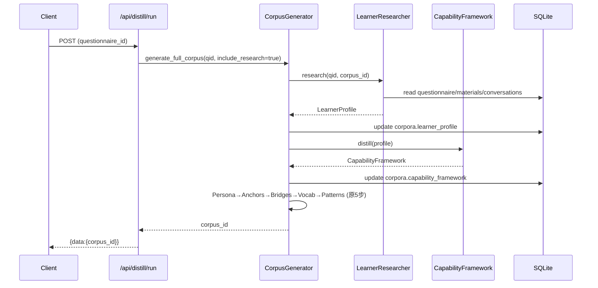

# DESIGN — 蒸馏链路三段式改造

## 1. 整体架构(适配后)

```mermaid
graph TB
    E0[客户端] --> E1{Entry Router}
    E1 -- 明确目标 --> S1[Stage 1 Research]
    E1 -- 模糊需求 --> D1[Diagnose] --> Q1[生成诊断问卷] --> E1
    S1 --> S2[Stage 2 Framework]
    S2 --> S3[Stage 3 Distill 5步]
    S3 --> PK[Runnable Skill Pack]
    S1 -. 读取 .-> Q[Questionnaire]
    S1 -. 读取 .-> M[Materials]
    S1 -. 读取 .-> C[Conversations]
    S1 -. 读取 .-> T[Topics]
    PK --> FS[skills/runnable/{id}/]
```

## 2. 模块分层

### 2.1 `services/learner_researcher.py` — Stage 1 深度调研
职责:从多源聚合,产出 `LearnerProfile`。

**输入**
```python
LearnerResearcher.research(
    questionnaire_id: str,
    corpus_id: str | None = None,   # 用于拉对话历史
    material_ids: list[str] = [],
    enable_web: bool = False
) -> dict
```

**产物 `LearnerProfile`**
```python
{
  "background": {
    "mbti_type": str,
    "interests": list[str],
    "personal_background": dict,
    "life_experiences": dict
  },
  "language_samples": list[{"source": "material|chat", "text": str}],
  "weakness_signals": list[str],          # 如 "avg_sentence_length<8"、"lack_connectors"
  "goal_vector": {
    "target_score": str,
    "priority_parts": list[str],           # P1 / P2 / P3
    "focus_topics": list[str]
  },
  "source_stats": {"materials": int, "chats": int, "topics": int},
  "generated_at": str
}
```

**降级**:无 materials/chats → `language_samples=[], weakness_signals=[]`,其余字段仅来自 questionnaire。

### 2.2 `services/capability_framework.py` — Stage 2 框架提炼
职责:从 `LearnerProfile` 抽象出「能力×场景×目标」三维矩阵。

**输入**
```python
CapabilityFramework.distill(learner_profile: dict) -> dict
```

**产物 `CapabilityFramework`**
```python
{
  "dimensions": {
    "ability": [ {"name": "lexical_range", "current": "6.0", "target": "6.5"}, ... ],
    "scenario": [ {"part": "P1", "topics": ["hometown", ...]}, ... ],
    "goal":     [ {"key": "target_score", "value": "6.5"},
                  {"key": "priority", "value": "P2_fluency"} ]
  },
  "pain_points": [ {"id": "pp1", "desc": "...", "signals": [...] } ],
  "lift_paths":  [ {"from": "6.0", "to": "6.5", "steps": [...] } ]
}
```

**实现策略**:优先 LLM 一次性 JSON 生成;失败时走规则兜底(基于 `weakness_signals` 直接构造最小骨架)。

### 2.3 改造 `services/corpus_generator.py`
在 `generate_full_corpus()` 的 Step 1 之前插入:
```python
if include_research:
    profile = await LearnerResearcher().research(questionnaire_id, corpus_id)
    await update_corpus(corpus_id, {"learner_profile": profile})
    framework = await CapabilityFramework().distill(profile)
    await update_corpus(corpus_id, {"capability_framework": framework})
    # 传入下游 generate_persona(..., extra_context={"framework": framework})
```
**兼容性**:新增 `include_research: bool = True`,旧调用行为不变(默认启用新链路,失败降级)。

### 2.4 改造 `services/skill_exporter.py`
新增方法:
```python
SkillExporter.export_runnable_skill(
    corpus_id: str,
    out_root: Path = None   # 默认 PersonaLingo/skills/runnable/
) -> Path
```
产物目录(4 个):
```
skills/runnable/{corpus_id}/
├── Skill.md                # 人读用说明 + 7 步链路
├── corpus.json             # 完整 corpus + learner_profile + framework
├── runtime_protocol.md     # Agent 执行协议(接口契约 / 调用示例)
└── prompts/
    └── README.md           # 仅列出下游 prompt 引用位置(非复制)
```

### 2.5 新增 `routers/distill.py`
端点:
| Method | Path | 作用 |
|---|---|---|
| POST | `/api/distill/diagnose` | 输入 `{text}` → 返回 `{questions: [...], suggested_score: str}` |
| POST | `/api/distill/run` | 查询参数 `questionnaire_id`, 可选 `include_research=bool` → 触发链路,返回 `corpus_id` |
| GET  | `/api/distill/skill/{corpus_id}/runnable` | 调用 `export_runnable_skill()` 并返回路径信息 |

**响应统一格式**
```json
{ "data": {...}, "error": null }
```

### 2.6 DB 字段扩展
`schemas.py`:
```sql
ALTER TABLE corpora ADD COLUMN learner_profile TEXT;
ALTER TABLE corpora ADD COLUMN capability_framework TEXT;
```
改动方式:在 `create_tables(db)` 末尾追加兼容迁移逻辑(`try/except OperationalError` 静默跳过已存在列)。

`crud.py`:
- `get_corpus()` 的 JSON 字段解析列表追加 `learner_profile`, `capability_framework`
- `update_corpus()` 的白名单追加这两个字段

### 2.7 配置扩展
`config.py` 新增:
```python
DISTILL_RESEARCH_WEB_SEARCH: bool = False   # .env: DISTILL_RESEARCH_WEB_SEARCH
SKILL_RUNNABLE_OUT_ROOT: str | None = None  # 默认计算为 PersonaLingo/skills/runnable/
```

## 3. 数据流示意



## 4. 接口契约

### 4.1 POST /api/distill/diagnose
请求
```json
{ "text": "我英语口语不太好,想提升但不知道目标" }
```
响应
```json
{
  "data": {
    "questions": [
      {"id": "q1", "text": "你希望多少天内参加雅思?", "type": "single", "options": ["30天内","3个月内","半年内","仅提升不考试"]},
      {"id": "q2", "text": "你希望的目标分数?", "type": "single", "options": ["6.0","6.5","7.0","7.5+"]},
      {"id": "q3", "text": "你觉得最薄弱的环节?", "type": "multi",  "options": ["词汇","流利度","发音","逻辑结构"]}
    ],
    "suggested_score": "6.5",
    "rationale": "根据你的描述..."
  },
  "error": null
}
```

### 4.2 POST /api/distill/run?questionnaire_id=xxx&include_research=true
响应
```json
{ "data": {"corpus_id": "...", "stages": ["research","framework","persona","anchors","bridges","vocabulary","patterns"]}, "error": null }
```

### 4.3 GET /api/distill/skill/{corpus_id}/runnable
响应
```json
{ "data": { "path": "skills/runnable/<id>/", "files": ["Skill.md","corpus.json","runtime_protocol.md","prompts/README.md"] }, "error": null }
```

## 5. 向后兼容性
- `POST /api/corpus/generate` 仍可用,其内部会调 `generate_full_corpus(qid)`,默认启用新链路,若新字段生成失败会降级为 5 步
- 旧 corpus 读取时 `learner_profile`/`capability_framework` 为 `None`,前端/导出需做 `or {}` 防御(已在现有导出代码中按惯例处理)

## 6. 测试计划
| 测试 | 覆盖 |
|---|---|
| `test_learner_researcher.py` | 无 material/chat 的降级路径 + 基本字段完整性 |
| `test_capability_framework.py` | LLM 失败降级到规则兜底 + 维度非空 |
| `test_skill_exporter_runnable.py` | 导出目录存在且 4 个产物齐全 |
