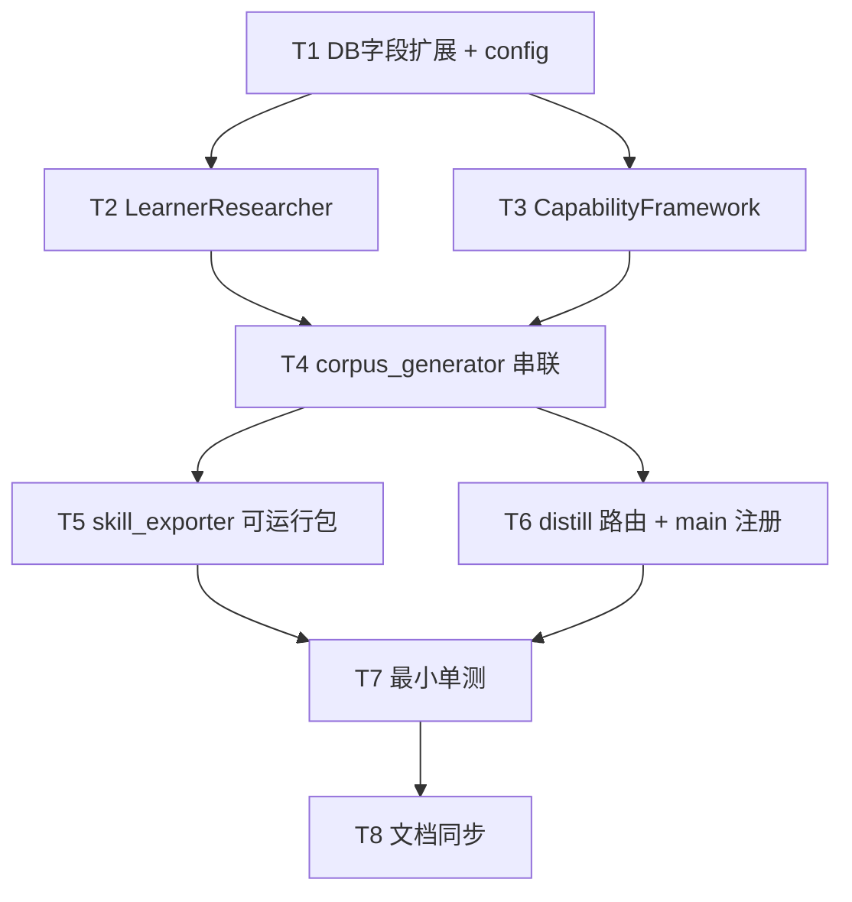

# TASK — 蒸馏链路三段式改造

## 1. 依赖图

## 2. 原子任务清单

### T1 — DB 字段扩展与配置
**输入**: 当前 `schemas.py` / `crud.py` / `config.py`
**输出**:
- `schemas.py` 追加兼容迁移逻辑(ALTER TABLE try/except)
- `crud.py::get_corpus / update_corpus` JSON 字段白名单扩展
- `config.py` 新增 `DISTILL_RESEARCH_WEB_SEARCH`、`SKILL_RUNNABLE_OUT_ROOT`
**验收**: 启动不报错;旧 corpus 读取不变;新字段可写入可读回

### T2 — LearnerResearcher (Stage 1)
**输入**: `questionnaire_id`, 可选 `corpus_id`
**输出**: `backend/app/services/learner_researcher.py`;类 `LearnerResearcher`;方法 `research()`
**接口契约**: 见 DESIGN §2.1
**验收**: 空材料/全材料两路径都能返回 `LearnerProfile` dict 且字段齐全

### T3 — CapabilityFramework (Stage 2)
**输入**: `LearnerProfile` dict
**输出**: `backend/app/services/capability_framework.py`;类 `CapabilityFramework`;方法 `distill()`
**接口契约**: 见 DESIGN §2.2
**验收**: LLM 失败时走规则兜底;`dimensions.ability/scenario/goal` 均非空

### T4 — corpus_generator 串联 7 步
**输入**: 现有 `generate_full_corpus(questionnaire_id)`
**输出**: 方法签名扩展 `generate_full_corpus(questionnaire_id, include_research: bool = True)`;在 Step 1 之前调用 Stage 1/2 并持久化
**验收**: 
- `include_research=False` 时行为与改造前一致(回归兼容)
- `include_research=True` 时 corpus 记录包含两个新字段

### T5 — skill_exporter 可运行包
**输入**: 现有 `SkillExporter`
**输出**: 新增方法 `export_runnable_skill(corpus_id, out_root=None) -> Path`
**产物文件**(4 个): 
- `Skill.md`: 含 7 步链路说明 + 语料库摘要
- `corpus.json`: 完整 corpus 数据 + learner_profile + capability_framework
- `runtime_protocol.md`: Agent 执行协议
- `prompts/README.md`: prompts 位置索引
**验收**: 目录存在且 4 文件齐全;`corpus.json` 可用 `json.load` 反序列化

### T6 — 路由 distill.py + main 注册
**输入**: 前述 T4/T5
**输出**: `backend/app/routers/distill.py` 含 3 端点;`main.py` 新增 `include_router`
**验收**: 启动后 3 端点返回 200(对已存在 questionnaire 而言)

### T7 — 最小单测
**输入**: T2/T3/T5 的模块
**输出**: 
- `backend/tests/test_learner_researcher.py`
- `backend/tests/test_capability_framework.py`
- `backend/tests/test_skill_exporter_runnable.py`
**验收**: 三个测试文件各 ≥1 个 case 并 pass(不依赖真实 LLM Key,使用 mock 或 LLM_UNAVAILABLE 降级路径)

### T8 — 文档同步
**输入**: 前述所有改动
**输出**:
- 更新 `PersonaLingo/skills/personalingo_skill.md` 的链路描述(5 步 → 7 步)
- 更新 `README.md` / `README_CN.md` 新增「三段式蒸馏」章节(仅新增不改动已有内容)
**验收**: 文档与代码链路保持一致

## 3. 执行检查清单(供 Approve)

- [x] 完整性: 7 步链路 + 4 差距均有对应任务
- [x] 一致性: T2/T3 产物字段与 T4 消费字段对齐
- [x] 可行性: 全部依赖现有 LLM 适配层与 CRUD,无新基础设施
- [x] 可控性: 单任务实现量均可控(~80-200 行),风险点在 T4(改接入处),已保留 `include_research` 开关做回滚
